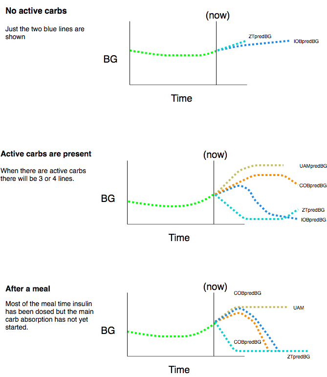
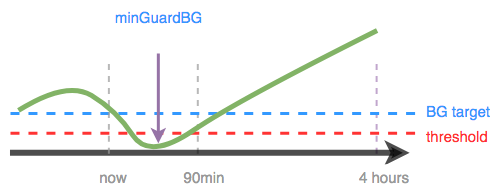
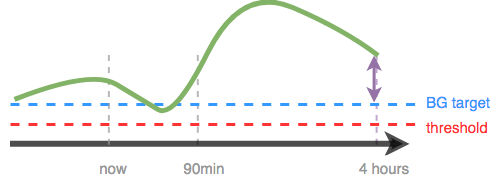
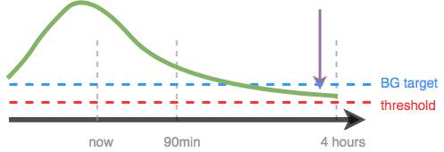

# How OpenAPS works

At its most basic OpenAPS works in much the same way that a person with diabetes does to determine insulin doses, corrections and the handling of carbohydrates. It works with the ratios that you are already familiar with and uses them to create a running forecast of what's happening with your blood sugar. The main difference is that OpenAPS updates this calculation every five minutes and that it performs the calculation much more precisely and takes more factors into account than a person with diabetes could do in practical terms in real life. 

## The basic basal calculations

Firstly, OpenAPS assumes that your programmed basal rates are correct and that if it does nothing then your blood glucose (BG) will remain constant. It uses this as a zero baseline. It can increase your insulin on board (IOB) by increasing the basal rate and reduce it by decreasing the basal rate - to zero if necessary.

Because it knows your pump history and the rate that insulin decays - or is "used up" - it can mantain a running total of all previous insulin doses (boluses and TBRs) to give an IOB figure relative to your programmed basal level.

In order to calculate a correction that will bring BG back to the desired target level it uses your insulin sensitivity factor (ISF) to calculate how much more or less IOB you need to bring your eventual BG back to target - the "eventual blood glucose" (eventualBG). Having calculated the appropriate correction "bolus" it calculates the temporary basal rate that would deliver that amount over 30 minutes and sets that on the pump. It repeats this calculation and updates the results every five minutes when it gets a fresh BG reading from your sensor. 

So ideally the following would always be true:

    BG - ISF x IOB = eventualBG = targetBG.

By constantly reviewing this equation and issuing temporary basal rates (TBRs) we can ensure that there is always the right amount of insulin on board (IOB) to bring BG eventually to the preconfigured target.

Fig 1: Basals are constantly adjusted so that BG - ISF x IOB = targetBG

You can read in greater detail about how OpenAPS calculates the amount of IOB [here](http://openaps.readthedocs.io/en/latest/docs/While%20You%20Wait%20For%20Gear/understanding-insulin-on-board-calculations.html).

## Adding in the carbs

We now need to take into account the effect of carbohydrates. One way to do this would be to estimate a rate at which carbs are absorbed and then try to work out an appropriate rate to deliver insulin by using the insulin to carb ratio (IC). However, as we know - unlike insulin which is absorbed in a fairly predictable way - different carbs are absorbed at different rates, and other factors, such as the amount of exercise, all have an effect - so we need something more dynamic.

The theory is that fast acting carbs will exert a strong upward pressure on BG but for a relatively short time, whereas slower acting carbs exert less pressure but for a longer time.

What OpenAPS does is to look at the upward pressure on BG and use that to estimate the rate at which carbs are being absorbed and then use that to estimate the rate at which insulin is needed to balance that upward pressure.

Of course, there are other things that can affect the upward pressure on BG, such as exercise. The problem here is that potentially the algorithm could be left thinking that there are still carbs on board when they have actually all gone. Therefore there is a parameter "min_5min_carbimpact" which acts as a safety valve such that carbs will always leak out of the algorithm at a minimum rate which is roughly equivalent to 24g/hr.

OpenAPS uses the rate at which insulin is being used up to calculate an expected blood glucose impact (BGI) - which is the rate at which BG would be expected to drop under the influence of insulin alone. You can see this on your AndroidAPS or Nightscout predictions screen as the "IOBpredBG" prediction. If the actual change in BG differs from this is it referred to as a "deviation" - which can be either positive or negative - and is influenced by carb absorption, exercise and other factors. The deviation is then used together with the insulin to carb ratio (IC) to determine how insulin delivery needs to be adjusted.

Clearly when there are carbs on board they will dominate the demand for insulin, which will be much reduced when there are no carbs. The trick is to ensure that there is a smooth transition between the two states.

## Understanding the coloured prediction lines

On your AndroidAPS Overview screen, if you enable Predictions, you will see a number of coloured prediction lines. (You can see the same lines in Nightscout if you enable OpenAPS predictions, but they are all in purple.) These lines show you the different BG predictions: based on current carb absorption (COBpredBG); insulin only (IOBpredBG); how long it will take BG to level off at/above target if deviations suddenly cease and we run a zero temp until then (ZTpredBG) and optionally: unannounced meal/effect detection (UAMpredBG).

These lines are helpful in understanding, at a glance, *why* OpenAPS is making the decisions it is, based on your near-term and longer-term BG predictions.

  * `COBpredG` - (orange) prediction based on the current level of carb absorption. This line only appears if you have carbs on board (COB > 0)
  * `ZTpredG` - (light blue) prediction based on Zero Temp from now on.
  * `IOBpredG` - (dark blue) prediction based on IOB alone with no carb absorption.
  * `UAMpredBG` - (yellow) prediction based on current deviations ramping down to zero at the same rate they have been recently. This line is only present if UAM is turned on in the preferences.

## OpenAPS algorithm examples

### Scenario 1 - BG predicted to drop below safety threshold longer term

Here although BG is rising in the short term it is predicted that BG (minGuardBG) will drop below the safety threshold in the longer term. OpenAPS will issue a zero temp, until the eventualBG (in any time frame) is above threshold.

### Scenario 2 - BG dropping and predicted to go below safety threshold short term

BG is currently dropping and is predicted to go low in the near-term, although it is predicted to eventually go above target. However, because the near-term low is below the safety threshold, OpenAPS will issue a zero temp, until there is no point where the prediction line dips below the threshold.

### Scenario 3 - Eventual BG above target

Although the near-term prediction shows a dip below target it does not dip below the safety threshold. The eventual BG is above target. Therefore, OpenAPS will not add insulin that would contribute to the near-term low (by adding insulin that would make the prediction go below threshold). When the low has passed and it is safe to do so it will start to add insulin to bring the lowest level of the eventual predicted BG down to target. *(Depending on your settings and the amount and timing of insulin required, this insulin may be delivered via temp basals or SMB's).*

### Scenario 4 - BG rising but eventualBG below target

In this example, OpenAPS sees that you are spiking well above your target. However, due to the timing of insulin, you already have enough in your body to bring you into range eventually. In fact, you are predicted to eventually be below target. Therefore, to prevent contributing to a low in the longer-timeframe OpenAPS will not provide extra insulin. Even though your BG is rising OpenAPS will issue a low or zero temporary basal rate.

## Exploring further

For every situation, the determine-basal output will be slightly different, but it should always provide a reasonable recommendation and list any temp basal that would be needed to start bringing BG back to target.  If you are unclear on why it is making a particular recommendation, you can explore further by searching lib/determine-basal/determine-basal.js (the library with the core decision tree logic) for the keywords in the reason field (for example, "setting" in this case would find a line (`rT.reason += ", setting " + rate + "U/hr";`) matching the output above, and from there you could read up and see what `if` clauses resulted in making that decision.  In this case, it was because (working backwards) `if (snoozeBG > profile.min_bg)` was false (so we took the `else`), but `if (eventualBG < profile.min_bg)` was true (with the explanatory comment to tell you that means "if eventual BG is below target").

If after reading through the code you are still unclear as to why determine-basal made a given decision (or think it may be the wrong decision for the situation), please join the [#intend-to-bolus channel on Gitter](https://gitter.im/nightscout/intend-to-bolus) or another support channel, paste your output and any other context, and we'll be happy to discuss with you what it was doing and why, and whether that's the best thing to do in that and similar situations.

# Other terms you may come across

* We also add other calculations that we do to better predict and analyze what is happening:
  * `BGI` (Blood Glucose Impact) = the degree to which BG “should” be rising or falling based on insulin activity alone.
  * `dev` or `deviation` = how much actual BG change is deviating from the BGI 
 
  * `ISF` = ISF is anchored from the value in your pump; but if you use autotune and/or autosens, the ISF value shown is what is currently being used by OpenAPS, as modified by the Sensitivity Ratio
  * `CR (Carb Ratio)` = As with ISF, it is anchored from the value in your pump; but if you use autotune and/or autosens, the CR value shown is what is currently being used by OpenAPS
  * `Eventual BG `= what BG is estimated to be by the end of DIA
  * `minGuardBG` - is the the lowest your BG is estimated to get over the period of DIA (Duration of Insulin Action). 
  * `IOBpredG` - predictions based on IOB alone.
  * `UAMpredBG` - predictions based on current deviations ramping down to zero at the same rate they have been recently. These represent the last entry on the purple prediction lines.
  * `Safety Threshold` = `min_bg - 0.5*(min_bg-40)` where `min_bg` is your BG target. This is the level below which `minGuardBG` will not be allowed to go.
  * `Sensitivity Ratio` = the ratio of how sensitive or resistant you are. This ratio is calculated by "Autosensitivity" (or "autosens"), and is applied to both basal and ISF to adjust accordingly. <1.0 = sensitive; >1.0 = resistant.  If your preferences allow it, sensitivityRatio can also be modified by temp targets.
  * `Target` = pulled from your pump target; overridden if you have enacted a temporary target running.
  * `Carb Impact` = we estimate carb impact by looking at what we predict to happen with your carbs entered (`predCI`) and adding it to our estimate of the remaining carb impact (`remainingCI`)

